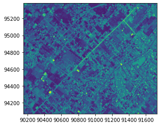
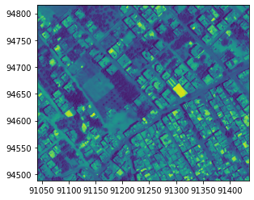
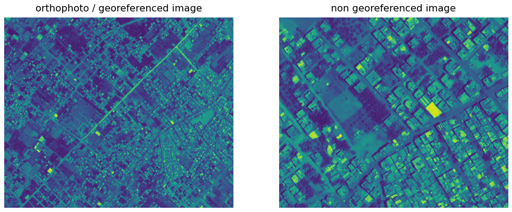
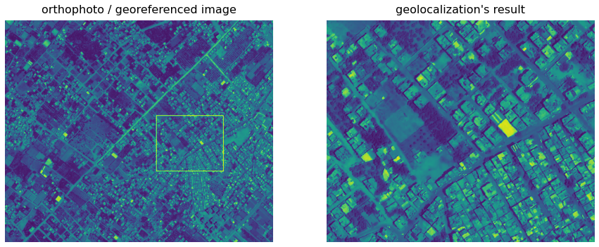

# Localization


```python
from localization import geolocalization
import rasterio as rio
from rasterio.plot import show
```

## Read the orthophoto / georeferenced image


```python
train = rio.open(r'Examples/train.tif')
show(train)
```





## Read the non georeferenced image


```python
query = rio.open(r'Examples/query.jpg')
show(query)
```


## The ```geolocalization``` will detects where's the non georeferenced image in the orthophoto



## Initialize the ```geolocalization```
```python
glocal = geolocalization(train,query)
```


## detection where's the non georeferenced image in the orthophoto then georeferencing it
```python
glocal.georeference(1,0.4)
```
Georeferencing done successfully... elapsed time\ 0.191 m
    


The ```geolocalization``` detected where's the non georeferenced image in the orthophoto



```python
## Yasser I Barhoom
```
